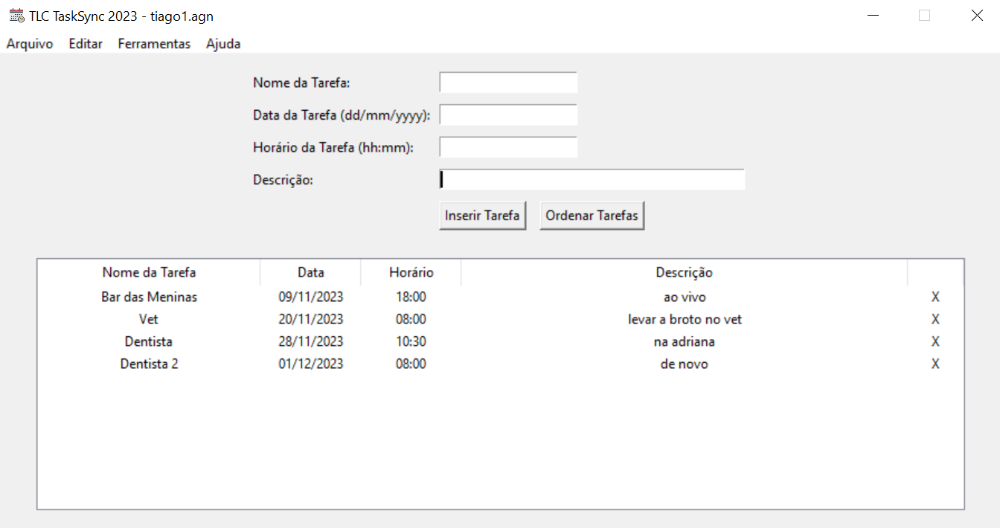

## GerenciadorTarefas
Uma aplicação Tkinter que é um Gerenciador de Tarefas

### Permite
- Inserir tarefas, com nome, data, hora e descrição
- Excluir tarefas
- Ordenar tarefas por data e hora
- Salvar agenda no formato .agn e carregar agendas salvas

### Características
- Data e Hora são campos que preenchem automaticamente no formato dd/mm/aaaa e hh:mm
- Data e Hora são campos que validam um máximo de caracteres permitidos
- Tem uma Splash Screen de apresentação  
- Tela Sobre com detalhes sobre a aplicação  

### Requisitos
- Python 3.x
- Biblioteca Tkinter

### Como Usar
- Clone ou baixe o repositório.
- Execute o arquivo main.py.
- Utilize a interface gráfica para adicionar, salvar, carregar e gerenciar tarefas.
